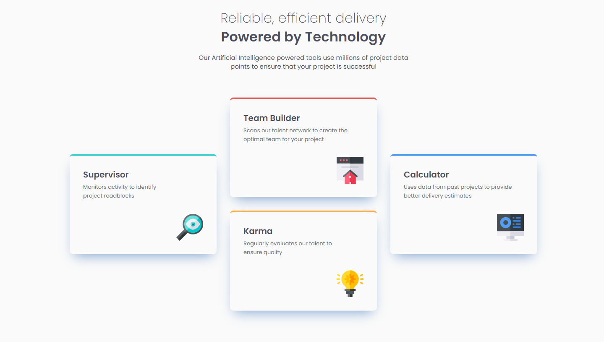

# Frontend Mentor - Four Card Feature Section

## Overview

A solution to the [Four Card Feature Section](https://www.frontendmentor.io/challenges/four-card-feature-section-weK1eFYK) challenge on Frontend Mentor. Built with plain HTML and CSS — no frameworks.

**Live Site:** https://hshs-dev.github.io/four-card-feature-section-master/

## Screenshot

    

## Built with

- Semantic HTML5
- CSS Grid with media queries for responsivity
- Flexbox on mobile instead of reseting all of grid rules
- Desktop-first workflow

## Reflections

### What I learned

- CSS Grid helps you make complex layouts without much pain
- Don't forget giving the correct number of columns/rows to `grid-template-columns/rows`
- `<article>` tag is more suitable for aggregated components (like cards) than `<section>` tag 

### Challenges

- Reseting media queries of a complex grid layout can be tricky and requires extra care and debugging

## Author

- GitHub - [@HsHs-dev](https://github.com/HsHs-dev)
