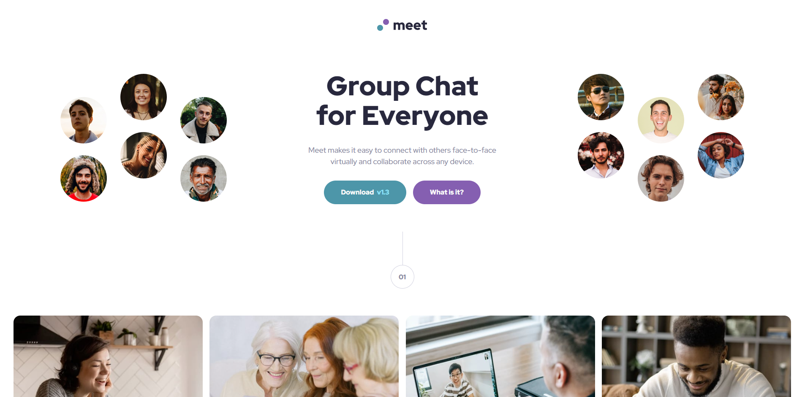

# Frontend Mentor - Meet Landing Page

A solution to the [Meet landing page](https://www.frontendmentor.io/challenges/meet-landing-page-rbTDS6OUR) challenge on Frontend Mentor. Built with plain HTML and CSS — no JavaScript or frameworks.

**Live Site:** [https://hshs-dev.github.io/meet-landing-page/](https://hshs-dev.github.io/meet-landing-page/)

**Repository:** [https://github.com/HsHs-dev/meet-landing-page](https://github.com/HsHs-dev/meet-landing-page)

## Design Preview

  

## Built with

- Semantic HTML5
- CSS custom properties
- Flexbox for component alignment and mobile layouts
- CSS Grid for the image gallery and desktop hero layout
- CSS pseudo-elements for decorative timeline elements
- CSS media queries for responsive layouts
- Native CSS nesting
- Mobile-first workflow
- Red Hat Display from Google Fonts

## Reflections

### What I learned

- **Choosing the right layout system:** Flexbox worked well for arranging elements in one direction, while Grid made it easier to control the gallery and reposition the hero content at larger screen sizes.
- **Responsive layout composition:** A layout can change structurally between breakpoints. The hero section uses a vertical arrangement on mobile and tablet, then places the text between the two hero images on desktop using CSS Grid.
- **CSS pseudo-elements:** The timeline's vertical connecting line can be created with `::before`, avoiding unnecessary HTML elements for purely decorative content.
- **CSS custom properties:** Defining colors, typography, and spacing as custom properties makes design values easier to maintain and reuse throughout the stylesheet.
- **Responsive backgrounds:** Media queries make it possible to use different footer background images for mobile, tablet, and desktop while keeping the same HTML structure.
- **Mobile-first development:** Starting with the simplest layout and progressively introducing Grid and other layout adjustments at larger breakpoints helps keep the base styles straightforward.

### Challenges

The main challenge was adapting the hero section to different screen sizes without duplicating its content in HTML.

On mobile and tablet, the hero images appear together above the text. On desktop, the images move to opposite sides of the text. Using CSS Grid and `display: contents` allowed the images to participate in the desktop grid without changing the underlying HTML structure.

Another challenge was managing the footer's responsive background images and the decorative numbered timeline elements while keeping their positioning consistent across screen sizes.

## Useful resources

- [Josh Comeau's CSS Reset](https://www.joshwcomeau.com/css/custom-css-reset/) - Used as the foundation for the project's CSS reset.
- [Google Fonts - Red Hat Display](https://fonts.google.com/specimen/Red+Hat+Display) - The typeface used throughout the design.

## AI Collaboration

I used AI as a study partner to discuss HTML semantics, evaluate CSS layout approaches, and refine my understanding of responsive design. The focus was on understanding the reasoning behind implementation choices rather than simply generating code.

## Author

- GitHub - [@HsHs-dev](https://github.com/HsHs-dev)
- Frontend Mentor - [@HsHs-dev](https://www.frontendmentor.io/profile/HsHs-dev)
